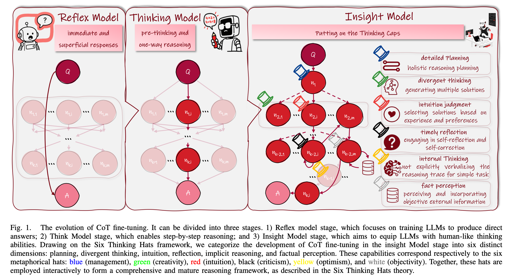
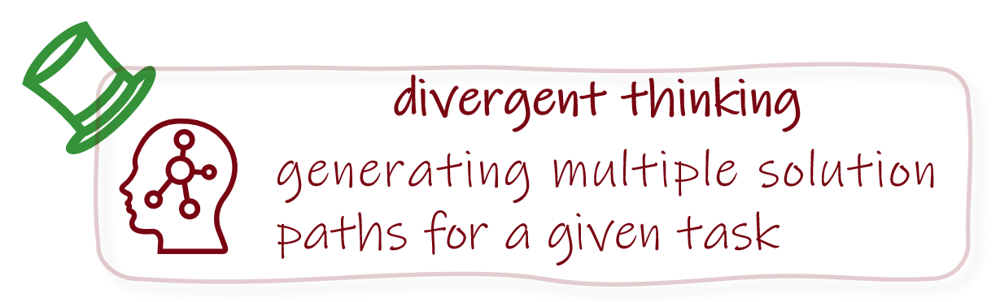
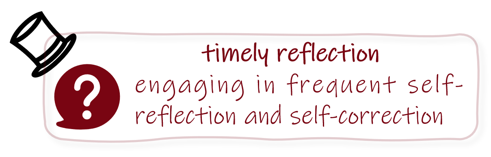
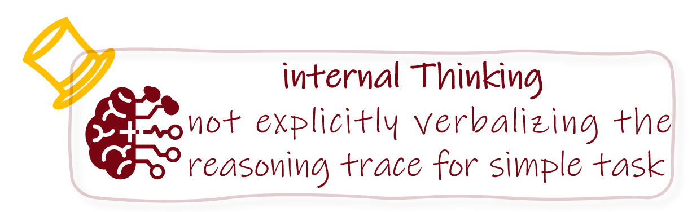
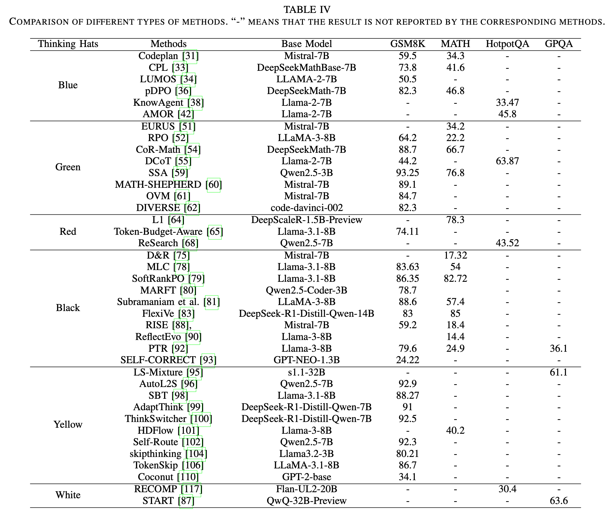

# Awesome-CoT-Finetuning

A collection of papers and datasets for the chain of thought finetuning (CoT-Finetuning) survey. We are looking forward to other participants to share their papers and codes. If interested, please contact chenxs@nudt.edu.cn or xschenranker@gmail.com. :fire: :fire: :fire: 

- Comprehensive Review: We comprehensively investigate typical CoT fine-tuning methods based on a bi-level taxonomy, i.e., top-level (Six Thinking Hats), and base-level (techniques), which offers a novel perspective on CoT fine-tuning and facilitates the understanding of the developmental trajectories among different CoT fine-tuning methods.
- Insightful Analysis: Based on the Six Thinking framework, we analyze the strengths and limitations of existing CoT fine-tuning methods in enabling LLMs to develop corresponding reasoning abilities, which provides valuable guidance for researchers in selecting an appropriate baseline for their research.
- Potential Opportunity: Building upon the Six Thinking Hats framework, we identify and summarize the key challenges currently faced by CoT fine-tuning and point out some potential opportunities that will inspire future studies.
- Open-source Resource: We will keep this GitHub repository continuously updated for researchers to track the latest developments.

:bell: :bell: :bell: Update at Oct 2025

# Bookmarks
- [Survey Papers](#survey-papers-)
- [Datasets](#datasets-)
- [Being a Thinking Model](#Thinking-)
    - [Supervised Fine-tuning](#SFT-)
    - [Reinforced Fine-tuning](#RFT-)
- [Being an Insight Model](#Insight-)
    - [Blue Hat](#Blue-)
    - [Green Hat](#Green-)
    - [Red Hat](#Red-)
    - [Black Hat](#Black-)
    - [Yellow Hat](#Yellow-)
    - [White Hat](#White-)

## Survey Papers 
| **Year** | **Title** | **Venue** |
|------|-------|-------|
| 2023 | [Towards Reasoning in Large Language Models: A Survey](https://arxiv.org/abs/2212.10403 ) | ACL | 
| 2025 | [Beyond chain-of-thought: A survey of chain-of-X paradigms for LLMs](https://aclanthology.org/2025.coling-main.719/) | ICCL | 
| 2024 | [Navigate through enigmatic labyrinth a survey of chain of thought reasoning: Advances, frontiers and future](https://aclanthology.org/2024.acl-long.65/) | ACL | 
| 2025 |  [Reasoning Language Models: A Blueprint](https://arxiv.org/abs/2501.11223 ) | Arxiv |
| 2025 | [Towards Large Reasoning Models: A Survey of Reinforced Reasoning with Large Language Models](https://arxiv.org/abs/2501.09686 )  | Arxiv | 
| 2025 | [Towards Reasoning Era: A Survey of Long Chain-of-Thought for Reasoning Large Language Models](https://arxiv.org/abs/2503.09567 ) | Arxiv |  
| 2025 |  [From System 1 to System 2: A Survey of Reasoning Large Language Models](https://arxiv.org/abs/2502.17419) | Arxiv | 
| 2025 | [LLM Post-Training: A Deep Dive into Reasoning Large Language Models](https://arxiv.org/abs/2502.21321 ) | Arxiv | 
| 2025 |  [Stop Overthinking: A Survey on Efficient Reasoning for Large Language Models (arxiv.org)](https://arxiv.org/abs/2503.16419) | Arxiv |             

## Datasets 
| **Category**   | **Dataset**   | **Train** | **Valid** | **Test** | **Task Description**                                | **Rationale (ie. CoT)** | **Dataset Download** | **Paper** |
|----------------|---------------|-----------|-----------|----------|-----------------------------------------------------|-------------------------|----------------------|-----------|
| General Task   | BBH           | 0         | 0         | 6,511    | 23 common reasoning tasks                           | No                      | [BBH](https://github.com/suzgunmirac/BIG-Bench-Hard) | [BBH](https://aclanthology.org/2023.findings-acl.824/) |
|                | SuperGPQA     | 0         | 0         | 26,529   | Graduate-level Q&A across 285 disciplines          | No                      | [SuperGPQA](https://supergpqa.github.io/) | [SuperGPQA](https://arxiv.org/abs/2502.14739) |
|                | MMLU          | 0         | 1,540     | 14,368   | Multiple-choice Q&A across 57 tasks                | No                      | [MMLU](https://github.com/hendrycks/test) | [MMLU](https://arxiv.org/pdf/2009.03300) |
|                | MMLUPro       | 0         | 70        | 12,032   | Q&A tasks across 285 disciplines                    | Partial                 | [MMLUPro](https://huggingface.co/spaces/TIGER-Lab/MMLU-Pro) | [MMLUPro](https://arxiv.org/pdf/2406.01574) |
| Mathematics    | GSM8K         | 7,500     | 0         | 1,000    | Grade school math                                    | Yes                     | [GSM8K](https://github.com/openai/grade-school-math) | [GSM8K](https://arxiv.org/abs/2110.14168) |
|                | MGSM          | 88        | 0         | 2,750    | Multilingual version of GSM8K                        | Yes                     | [MGSM](https://github.com/google-research/url-nlp) | [MGSM](https://openreview.net/forum?id=fR3wGCk-IXp) |
|                | AQuA          | 100,949   | 250       | 250      | Algebraic word problems                              | Yes                     | [AQuA](https://github.com/deepmind/AQuA) | [AQuA](https://aclanthology.org/P17-1015/) |
|                | MATH          | 7,500     | 0         | 5,000    | Competitive math                                     | Yes                     | [MATH](https://github.com/hendrycks/apps) | [MATH](https://arxiv.org/pdf/2103.03874) |
|                | AIME          | 0         | 0         | Updated annually | American invitational mathematics examination | Yes                     | [AIME](https://artofproblemsolving.com/wiki/index.php/AIME_Problems_and_Solutions) | [AIME](https://artofproblemsolving.com/wiki/index.php/AIME_Problems_and_Solutions) |
|                | Geometry3K    | 2,101     | 300       | 601      | Geometry Problem with symbolic reasoning             | No                      | [Geometry3K](https://lupantech.github.io/inter-gps) | [Geometry3K](https://aclanthology.org/2021.acl-long.528/) |
| Coding         | CodeContests  | 13,328    | 117       | 165      | Competitive programming                              | No                      | [CodeContests](https://www.science.org/doi/10.1126/science.abq1158) | [CodeContests](https://www.science.org/doi/abs/10.1126/science.abq1158) |
|                | LiveCodeBench | 0         | 0         | Continuous updates | Periodically updated programming             | No                      | [LiveCodeBench](https://livecodebench.github.io/) | [LiveCodeBench](https://openreview.net/forum?id=chfJJYC3iL) |
|                | MHPP          | 0         | 0         | 210      | Manually created Python programming                  | No                      | [MHPP](https://github.com/SparksofAGI/MHPP) | [MHPP](https://openreview.net/forum?id=TVFVx8TUbN) |
|                | EquiBench     | 0         | 0         | 2,400    | Equivalence checking for two programs                | No                      | [EquiBench](https://github.com/Anjiang-Wei/equibench) | [EquiBench](https://doi.org/10.48550/arXiv.2502.12466) |
|                | MBPP Pro      | 0         | 0         | 378      | Self-invoking code generation                        | No                      | [MBPP Pro](https://github.com/CodeEval-Pro/CodeEval-Pro) | [MBPP Pro](https://aclanthology.org/2025.findings-acl.686/) |
|                | SWEbench      | 19,000    | 0         | 2,294    | Solving real-world GitHub issues                     | No                      | [SWEbench](https://www.swebench.com/) | [SWEbench](https://openreview.net/forum?id=VTF8yNQM66) |
|                | BFCL v3       | 0         | 0         | 2,000    | Function-calling tasks                               | No                      | [BFCL v3](https://gorilla.cs.berkeley.edu/blogs/8_berkeley_function_calling_leaderboard.html#benchmarking) | [BFCL v3](https://gorilla.cs.berkeley.edu/blogs/8_berkeley_function_calling_leaderboard.html#benchmarking) |
| Commonsense    | HotpotQA      | 90,564    | 7,405     | 14,810   | Reading comprehension                                | No                      | [HotpotQA](https://HotpotQA.github.io) | [HotpotQA](https://aclanthology.org/D18-1259/) |
|                | CommonsenseQA | 9,797     | 1,225     | 1,225    | Multiple-choice Q&A                                  | No                      | [CommonsenseQA](https://www.tau-nlp.org/commonsenseqa) | [CommonsenseQA](https://aclanthology.org/N19-1421/) |
|                | StrategyQA    | 2,290     | 0         | 490      | True or false Q&A                                    | Yes                     | [StrategyQA](https://allenai.org/data/strategyqa) | [StrategyQA](https://aclanthology.org/2021.tacl-1.21/) |
|                | OpenBookQA    | 13,328    | 117       | 165      | Multiple-choice Q&A                                  | No                      | [OpenBookQA](http://data.allenai.org/OpenBookQA) | [OpenBookQA](https://aclanthology.org/D18-1260/) |
| Domain Knowledge| MedQA         | 48,876    | 6,109     | 6,112    | Multilingual multiple-choice medical Q&A             | No                      | [MedQA](https://github.com/jind11/MedQA) | [MedQA](https://arxiv.org/pdf/2009.13081) |
|                | JAMA          | 0         | 0         | 1,524    | Multiple-choice clinical Q&A                         | Yes                     | [JAMA](https://github.com/HanjieChen/ChallengeClinicalQA) | [JAMA](https://aclanthology.org/2025.naacl-long.182/) |
|                | MedXpertQA    | 0         | 0         | 4,460    | Multimodal multiple-choice medical Q&A               | Yes                     | [MedXpertQA](https://github.com/TsinghuaC3I/MedXpertQA) | [MedXpertQA](https://openreview.net/forum?id=IyVcxU0RKI) |
|                | GPQA          | 0         | 0         | 448      | Biology, physics, and chemistry multiple-choice Q&A  | Yes                     | [GPQA](https://github.com/idavidrein/gpqa/) | [GPQA](https://openreview.net/forum?id=Ti67584b98) |
|                | Zebralogic    | 0         | 0         | 1,000    | Logic grid puzzles                                   | No                      | [ZebraLogic](https://hf.co/spaces/allenai/ZebraLogic) | [ZebraLogic](https://openreview.net/forum?id=sTAJ9QyA6l) |
| Others         | ToolBench     | 0         | 0         | 1,524    | General tool-use tasks                               | Yes                     | [ToolBench](https://github.com/OpenBMB/ToolBench) | [ToolBench](https://arxiv.org/pdf/2307.16789) |
|                | ALFWorld      | 3,553     | 0         | 274      | 6 types of decision making tasks                     | No                      | [ALFWorld](https://alfworld.github.io/) | [ALFWorld](https://openreview.net/forum?id=0IOX0YcCdTn) |
|                | ChartQA-H     | 7,398     | 960       | 1,250    | Charts with visual and logical reasoning             | No                      | [ChartQA-H](https://github.com/vis-nlp/ChartQA) | [ChartQA-H](https://aclanthology.org/2022.findings-acl.177/) |
|                | ChartQA-M     | 20,901    | 960       | 1,250    | Charts with visual and logical reasoning             | No                      | [ChartQA-M](https://github.com/vis-nlp/ChartQA) | [ChartQA-M](https://aclanthology.org/2022.findings-acl.177/) |

## Being a Thinking Model 
### Supervised Fine-tuning (SFT) 
#### Training Methods
| **Year**   | **Title**                                                                                     |  **Venue**    |                                       **Paper**                                            | **Code** |
| ---- |----------------------------------------------------------------------------------|:--------:|:---------------------------------------------------------------------------------:|:----:|
| 2021  | **Show Your Work: Scratchpads for Intermediate Computation with Language Models**   |  Arxiv    |                   [Link](https://arxiv.org/abs/2112.00114)                    | -   |
| 2021  | **Measuring Association Between Labels and Free-Text Rationales**   |  EMNLP    |                   [Link](https://aclanthology.org/2021.emnlp-main.804v2.pdf)                    | [link](https://github.com/allenai/label_rationale_association)   |
| 2023  | **Teaching Small Language Models to Reason**   |  ACL    |                   [Link](https://aclanthology.org/2023.acl-short.151.pdf)                    | -   |
| 2023  | **Large Language Models Are Reasoning Teachers**   |  ACL    |                   [Link](https://aclanthology.org/2023.acl-long.830.pdf)                    | [link](https://github.com/itsnamgyu/reasoning-teacher)   |
| 2023  | **SCOTT: Self-Consistent Chain-of-Thought Distillation**   |  ACL    |                   [Link](https://aclanthology.org/2023.acl-long.304v2.pdf)                    | -   |
| 2023  | **Distilling Step-by-Step! Outperforming Larger Language Models with Less Training Data and Smaller Model Sizes**   |  ACL    |                   [Link](https://aclanthology.org/2023.findings-acl.507.pdf)                    | [link](https://github.com/google-research/distilling-step-by-step)   |
| 2023  | **Specializing smaller language models towards multi-step reasoning**   |  ICML    |                   [Link](https://proceedings.mlr.press/v202/fu23d/fu23d.pdf)                    | [link](https://github.com/FranxYao/FlanT5-CoT-Specialization)   |
| 2023  | **Faithful Chain-of-Thought Reasoning**   |  IJCNLP    |                   [Link](https://aclanthology.org/2023.ijcnlp-main.20.pdf)                    | [link](https://github.com/veronica320/Faithful-COT)   |
| 2023  | **Measuring faithfulness in chain-of-thought reasoning**   |  Arxiv    |                   [Link](https://storage.prod.researchhub.com/uploads/papers/2023/08/01/2307.13702.pdf)                    | -   |
| 2024  | **Distilling reasoning ability from large language models with adaptive thinking**   |  IEEE T-NNLS    |                   [Link](https://arxiv.org/pdf/2404.09170)                    | -   |
| 2024  | **Mind’s Mirror: Distilling Self-Evaluation Capability and Comprehensive Thinking from Large Language Models**   |  NAACL    |                   [Link](https://aclanthology.org/2024.naacl-long.376.pdf)                    | [link](https://github.com/Attention-is-All-I-Need/Mind-s-Mirror-Distilling-LLM)   |
| 2024  | **Learning to Maximize Mutual Information for Chain-of-Thought Distillation**   |  ACL    |                   [Link](https://aclanthology.org/2024.findings-acl.409.pdf)                    | [link](https://github.com/xinchen9/cot_distillation_ACL2024)   |
| 2024  | **MinT: Boosting Generalization in Mathematical Reasoning via Multi-view Fine-tuning**   |  LREC-COLING    |                   [Link](https://aclanthology.org/2024.lrec-main.988.pdf)                    | [link](https://github.com/Zhenwen-NLP/MinT-COLING2024)   |
| 2024  | **MoDE-CoTD: Chain-of-Thought Distillation for Complex Reasoning Tasks with Mixture of Decoupled LoRA-Experts**   |  LREC-COLING    |                   [Link](https://aclanthology.org/2024.lrec-main.1003.pdf)                    | [link](https://github.com/Xiang-Li-oss/MoDE-CoTD)   |
| 2024  | **The llama 3 herd of models**   |  Arxiv    |                   [Link](https://arxiv.org/pdf/2407.21783)                    | -   |
| 2024  | **Making Reasoning Matter: Measuring and Improving Faithfulness of Chain-of-Thought Reasoning**   |  ENMLP    |                   [Link](https://aclanthology.org/2024.findings-emnlp.882.pdf)                    | [link](https://debjitpaul.github.io/reasoningmatter/)   |
| 2025  | **Gemini 2.5: Pushing the frontier with advanced reasoning, multimodality, long context, and next generation agentic capabilities**   |  Arxiv    |                   [Link](https://arxiv.org/pdf/2507.06261)                    | -   |
| 2025  | **Deepseek-r1: Incentivizing reasoning capability in llms via reinforcement learning**   |  Arxiv    |                   [Link](https://arxiv.org/pdf/2501.12948?)                    | -   |

#### Acquiring CoT 
| **Year**   | **Title**                                                                                     |  **Venue**    |                                       **Paper**                                            | **Code** |
| ---- |----------------------------------------------------------------------------------|:--------:|:---------------------------------------------------------------------------------:|:----:|
| 2007  | **Using “Annotator Rationales” to Improve Machine Learning for Text Categorization**   |  NAACL    |                   [Link](https://aclanthology.org/N07-1033.pdf)                    | -   |
| 2018  | **e-snli: natural language inference with natural language explanations**   |  NeurIPS    |                   [Link](https://proceedings.neurips.cc/paper_files/paper/2018/file/4c7a167bb329bd92580a99ce422d6fa6-Paper.pdf)                    | [link](https://github.com/OanaMariaCamburu/e-SNLI)   |
| 2018  | **Looking beyond the surface:a challenge set for reading comprehension over multiple sentences**   |  NAACL    |                   [Link](https://aclanthology.org/N18-1023.pdf)                    | -   |
| 2018  | **FEVER: a Large-scale Dataset for Fact Extraction and VERification**   |  NAACL    |                   [Link](https://aclanthology.org/N18-1074.pdf)                    | [link](https://github.com/awslabs/fever)   |
| 2019  | **Explain Yourself! Leveraging Language Models for Commonsense Reasoning**   |  ACL    |                   [Link](https://aclanthology.org/P19-1487.pdf)                    | -   |
| 2020  | **e-snli-ve: Corrected visual-textual entailment with natural language explanations**   |  Arxiv    |                   [Link](https://arxiv.org/pdf/2307.16789)                    | [link](https://github.com/maximek3/e-ViL)   |
| 2021  | **Measuring mathematical problem solving with the math dataset**   |  NeurIPS    |                   [Link](https://arxiv.org/pdf/2103.03874)                    | [link](https://github.com/hendrycks/apps)   |
| 2021  | **Training Verifiers to Solve Math Word Problems**   |  Arxiv    |                   [Link](https://arxiv.org/pdf/2110.14168)                    | -   |
| 2021  | **Webgpt: Browser-assisted question-answering with human feedback**   |  Arxiv    |                   [Link](https://arxiv.org/pdf/2112.09332)                    | -   |
| 2022  | **Chain-of-thought prompting elicits reasoning in large language models**   |  NeurIPS    |                   [Link](https://proceedings.neurips.cc/paper_files/paper/2022/file/9d5609613524ecf4f15af0f7b31abca4-Paper-Conference.pdf)                    | -   |
| 2023  | **Toolllm: Facilitating large language models to master 16000+ real-world apis**   |  Arxiv    |                   [Link](https://arxiv.org/pdf/2307.16789)                    | [link](https://github.com/OpenBMB/ToolBench)   |
| 2023  | **Teaching Small Language Models to Reason**   |  ACL    |                   [Link](https://aclanthology.org/2023.acl-short.151.pdf)                    | -   |
| 2023  | **Large Language Models Are Reasoning Teachers**   |  ACL    |                   [Link](https://aclanthology.org/2023.acl-long.830.pdf)                    | [link](https://github.com/itsnamgyu/reasoning-teacher)   |
| 2023  | **SCOTT: Self-Consistent Chain-of-Thought Distillation**   |  ACL    |                   [Link](https://aclanthology.org/2023.acl-long.304v2.pdf)                    | -   |
| 2023  | **Distilling Step-by-Step! Outperforming Larger Language Models with Less Training Data and Smaller Model Sizes**   |  ACL    |                   [Link](https://aclanthology.org/2023.findings-acl.507.pdf)                    | [link](https://github.com/google-research/distilling-step-by-step)   |
| 2023  | **Specializing smaller language models towards multi-step reasoning**   |  ICML    |                   [Link](https://proceedings.mlr.press/v202/fu23d/fu23d.pdf)                    | [link](https://github.com/FranxYao/FlanT5-CoT-Specialization)   |
| 2024  | **MoDE-CoTD: Chain-of-Thought Distillation for Complex Reasoning Tasks with Mixture of Decoupled LoRA-Experts**   |  LREC-COLING    |                   [Link](https://aclanthology.org/2024.lrec-main.1003.pdf)                    | [link](https://github.com/Xiang-Li-oss/MoDE-CoTD)   |
| 2024  | **Mind’s Mirror: Distilling Self-Evaluation Capability and Comprehensive Thinking from Large Language Models**   |  NAACL    |                   [Link](https://aclanthology.org/2024.naacl-long.376.pdf)                    | [link](https://github.com/Attention-is-All-I-Need/Mind-s-Mirror-Distilling-LLM)   |
| 2024  | **Distilling reasoning ability from large language models with adaptive thinking**   |  IEEE T-NNLS    |                   [Link](https://arxiv.org/pdf/2404.09170)                    | -   |
| 2024  | **GPQA: A Graduate-Level Google-Proof Q&A Benchmark**   |  COLM    |                   [Link](https://openreview.net/pdf?id=Ti67584b98)                    | [link](https://github.com/idavidrein/gpqa/)   |
| 2024  | **O1 replication journey: A strategic progress report–part 1**   |  Arxiv    |                   [Link](https://arxiv.org/pdf/2410.18982)                    | [link](https://github.com/GAIR-NLP/O1-Journey)   |
| 2024  | **O1 replication journey–part 2: Surpassing o1-preview through simple distillation, big progress or bitter lesson?**   |  Arxiv    |                   [Link](https://arxiv.org/pdf/2411.16489)                    | [link](https://github.com/GAIR-NLP/O1-Journey)   |
| 2024  | **Drt-o1: Optimized deep reasoning translation via long chain-of-thought**   |  Arxiv    |                   [Link](https://arxiv.org/pdf/2412.17498)                    | [link](https://github.com/krystalan/DRT)   |
| 2024  | **PaD: Program-aided Distillation Can Teach Small Models Reasoning Better than Chain-of-thought Fine-tuning**   |  NAACL    |                   [Link](https://aclanthology.org/2024.naacl-long.142.pdf)                    | [link](https://github.com/Xuekai-Zhu/pad)   |
| 2024  | **Distilling mathematical reasoning capabilities into Small Language Models**   |  Neural Networks    |                   [Link](https://doi.org/10.1016/j.neunet.2024.106594)                    | -   |
| 2024  | **Llava-cot: Let vision language models reason step-by-step**   |  Arxiv    |                   [Link](https://arxiv.org/pdf/2411.10440)                    | [link](https://github.com/PKU-YuanGroup/LLaVA-CoT)   |
| 2024  | **Marco-o1: Towards open reasoning models for open-ended solutions**   |  Arxiv    |                   [Link](https://arxiv.org/pdf/2411.14405)                    | [link](https://github.com/AIDC-AI/Marco-o1)   |
| 2024  | **Mulberry: Empowering mllm with o1-like reasoning and reflection via collective monte carlo tree search**   |  Arxiv    |                   [Link](https://arxiv.org/pdf/2412.18319)                    | [link](https://github.com/HJYao00/Mulberry)   |
| 2024  | **Boosting Language Models Reasoning with Chain-of-Knowledge Prompting**   |  ACL    |                   [Link](https://aclanthology.org/2024.acl-long.271.pdf)                    | [link](https://github.com/wjn1996/Chain-of-Knowledge)   |
| 2025  | **Benchmarking Large Language Models on Answering and Explaining Challenging Medical Questions**   |  NAACL    |                   [Link](https://aclanthology.org/2025.naacl-long.182.pdf)                    | [link](https://github.com/HanjieChen/ChallengeClinicalQA)   |
| 2025  | **MedXpertQA: Benchmarking Expert-Level Medical Reasoning and Understanding**   |  ICML    |                   [Link](https://openreview.net/pdf?id=IyVcxU0RKI)                    | [link](https://github.com/TsinghuaC3I/MedXpertQA)   |
| 2025  | **Deepmath-103k: A large-scale, challenging, decontaminated, and verifiable mathematical dataset for advancing reasoning**   |  Arxiv    |                   [Link](https://arxiv.org/pdf/2504.11456?)                    | [link](https://github.com/zwhe99/DeepMath)   |
| 2025  | **MedReason: Eliciting Factual Medical Reasoning Steps in LLMs via Knowledge Graphs**   |  Arxiv    |                   [Link](https://arxiv.org/pdf/2504.00993)                    | [link](https://github.com/UCSC-VLAA/MedReason)   |

### Reinforced Fine-tuning (RFT) 
#### Training Methods
| **Year**   | **Title**                                                                                     |  **Venue**    |                                       **Paper**                                            | **Code** |
| ---- |----------------------------------------------------------------------------------|:--------:|:---------------------------------------------------------------------------------:|:----:|
| 1992  | **Simple statistical gradient-following algorithms for connectionist reinforcement learning**   |  Machine Learning    |                   [Link](https://link.springer.com/content/pdf/10.1007/BF00992696.pdf)                    | -   |
| 1999  | **Actor-critic algorithms**   |  NeurIPS    |                   [Link](https://proceedings.neurips.cc/paper/1999/file/6449f44a102fde848669bdd9eb6b76fa-Paper.pdf)                    | -   |
| 2015  | **Trust region policy optimization**   |  ICML    |                   [Link](http://proceedings.mlr.press/v37/schulman15.pdf)                    | -   |
| 2016  | **Sample efficient actor-critic with experience replay**   |  Arxiv    |                   [Link](https://arxiv.org/pdf/1611.01224)                    | -   |
| 2016  | **Asynchronous methods for deep reinforcement learning**   |  ICML    |                   [Link](https://users.soe.ucsc.edu/~pang/200/f18/papers/2018/mniha16.pdf)                    | -   |
| 2016  | **Reinforcement learning through asynchronous advantage actor-critic on a gpu**   |  Arxiv    |                   [Link](https://arxiv.org/pdf/1611.06256)                    | [link](https://github.com/NVlabs/GA3C)   |
| 2017  | **Scalable trust-region method for deep reinforcement learning using kronecker-factored approximation,**   |  NeurIPS    |                   [Link](http://proceedings.neurips.cc/paper/2017/file/361440528766bbaaaa1901845cf4152b-Paper.pdf)                    | [link](https://github.com/openai/baselines)   |
| 2017  | **Proximal policy optimization algorithms**   |  Arxiv    |                   [Link](https://arxiv.org/pdf/1707.06347)                    | [link](https://github.com/berkeleydeeprlcourse/homework/tree/master/hw4)   |
| 2022  | **Training language models to follow instructions with human feedback**   |  NeurIPS    |                   [Link](https://proceedings.neurips.cc/paper_files/paper/2022/file/b1efde53be364a73914f58805a001731-Paper-Conference.pdf)                    | -   |
| 2022  | **Penalized proximal policy optimization for safe reinforcement learning**   |  IJCAI    |                   [Link](https://arxiv.org/pdf/2205.11814)                    | -   |
| 2022  | **STaR: Bootstrapping Reasoning With Reasoning**   |  NeurIPS    |                   [Link](https://openreview.net/pdf?id=_3ELRdg2sgI)                    | [link](https://github.com/ezelikman/STaR)   |
| 2023  | **Direct preference optimization: Your language model is secretly a reward model**   |  NeurIPS    |                   [Link](https://proceedings.neurips.cc/paper_files/paper/2023/file/a85b405ed65c6477a4fe8302b5e06ce7-Paper-Conference.pdf)                    | -   |
| 2023  | **Reinforced Self-Training (ReST) for Language Modeling**   |  Arxiv    |                   [Link](https://arxiv.org/pdf/2308.08998)                    | -   |
| 2023  | **RAFT: Reward rAnked FineTuning for Generative Foundation Model Alignment**   |  TMLR    |                   [Link](https://openreview.net/pdf?id=m7p5O7zblY)                    | [link](https://github.com/OptimalScale/LMFlow)   |
| 2024  | **Statistical rejection sampling improves preference optimization**   |  ICLR    |                   [Link](https://arxiv.org/pdf/2309.06657)                    | -   |
| 2024  | **A general theoretical paradigm to understand learning from human preferences**   |  AISTATS    |                   [Link](https://proceedings.mlr.press/v238/gheshlaghi-azar24a/gheshlaghi-azar24a.pdf)                    | -   |
| 2024  | **Eliminating biased length reliance of direct preference optimization via down-sampled kl divergence**   |  EMNLP    |                   [Link](https://arxiv.org/pdf/2406.10957)                    | [link](https://github.com/LuJunru/SamPO/)   |
| 2024  | **Token-level direct preference optimization**   |  ICML    |                   [Link](https://arxiv.org/pdf/2404.11999?)                    | [link](https://github.com/Vance0124/Token-level-Direct-Preference-Optimization)   |
| 2024  | **Model alignment as prospect theoretic optimization**   |  ICML    |                   [Link](https://openreview.net/pdf?id=iUwHnoENnl)                    | [link](https://github.com/ContextualAI/HALOs)   |
| 2024  | **Contrastive Preference Optimization: Pushing the Boundaries of LLM Performance in Machine Translation**   |  ICML    |                   [Link](https://openreview.net/pdf?id=51iwkioZpn)                    | [link](https://github.com/fe1ixxu/ALMA)   |
| 2024  | **Direct language model alignment from online ai feedback**   |  Arxiv    |                   [Link](https://arxiv.org/pdf/2402.04792)                    | -   |
| 2024  | **Beyond Human Data: Scaling Self-Training for Problem-Solving with Language Models**   |  TMLR    |                   [Link](https://openreview.net/pdf?id=lNAyUngGFK)                    | -   |
| 2024  | **V-STaR: Training Verifiers for Self-Taught Reasoners**   |  Arxiv    |                   [Link](https://arxiv.org/pdf/2402.06457)                    | -   |
| 2024  | **Weak-to-Strong Reasoning**   |  EMNLP    |                   [Link](https://aclanthology.org/2024.findings-emnlp.490.pdf)                    | [link](https://github.com/GAIR-NLP/weak-to-strong-reasoning)   |
| 2024  | **Re-ReST: Reflection-Reinforced Self-Training for Language Agents**   |  EMNLP    |                   [Link](https://aclanthology.org/2024.emnlp-main.861.pdf)                    | [link](https://github.com/PlusLabNLP/Re-ReST)   |
| 2025  | **What's Behind PPO's Collapse in Long-CoT? Value Optimization Holds the Secret**   |  Arxiv    |                   [Link](https://arxiv.org/pdf/2503.01491)                    | -   |
| 2025  | **Vapo: Efficient and reliable reinforcement learning for advanced reasoning tasks**   |  Arxiv    |                   [Link](https://arxiv.org/pdf/2504.05118?)                    | -   |
| 2025  | **Dapo: An open-source llm reinforcement learning system at scale**   |  Arxiv    |                   [Link](https://arxiv.org/pdf/2503.14476)                    | [link](https://github.com/BytedTsinghua-SIA/DAPO)   |
| 2025  | **Dra-grpo: Exploring diversity-aware reward adjustment for r1-zero-like training of large language models**   |  Arxiv    |                   [Link](https://arxiv.org/pdf/2505.09655?)                    | [link](https://github.com/xiwenc1/DRA-GRPO)   |
| 2025  | **Critique-grpo: Advancing llm reasoning with natural language and numerical feedback**   |  Arxiv    |                   [Link](https://arxiv.org/pdf/2506.03106)                    | [link](https://github.com/zhangxy-2019/critique-GRPO)   |
| 2025  | **Video-r1: Reinforcing video reasoning in mllms**   |  Arxiv    |                   [Link](https://arxiv.org/pdf/2503.21776)                    | [link](https://github.com/tulerfeng/Video-R1)   |
| 2025  | **Reinforcing video reasoning with focused thinking**   |  Arxiv    |                   [Link](https://arxiv.org/pdf/2505.24718?)                    | [link](https://github.com/longmalongma/TW-GRPO)   |
| 2025  | **Deepmath-103k: A large-scale, challenging, decontaminated, and verifiable mathematical dataset for advancing reasoning**   |  Arxiv    |                   [Link](https://arxiv.org/pdf/2504.11456?)                    | [link](https://github.com/zwhe99/DeepMath)   |
| 2025  | **Diffucoder: Understanding and improving masked diffusion models for code generation**   |  Arxiv    |                   [Link](https://arxiv.org/pdf/2506.20639)                    | [link](https://github.com/apple/ml-diffucoder)   |
| 2025  | **Videochat-r1: Enhancing spatio-temporal perception via reinforcement fine-tuning**   |  Arxiv    |                   [Link](https://arxiv.org/pdf/2504.06958?)                    | [link](https://github.com/OpenGVLab/VideoChat-R1)   |
| 2025  | **DPO Meets PPO: Reinforced Token Optimization for RLHF**   |  ICML    |                   [Link](https://openreview.net/pdf?id=IfWKVF6LfY)                    | [link](https://github.com/zkshan2002/RTO)   |
#### Reward Modeling
| **Year**   | **Title**                                                                                     |  **Venue**    |                                       **Paper**                                            | **Code** |
| ---- |----------------------------------------------------------------------------------|:--------:|:---------------------------------------------------------------------------------:|:----:|
| 2016  | **Concrete Problems in AI Safety**   |  Arxiv    |                  [Link](https://arxiv.org/pdf/1606.06565)                    | -   |
| 2017  | **Deep reinforcement learning from human preferences**   |  NeurIPS    |                   [Link](https://proceedings.neurips.cc/paper_files/paper/2017/file/d5e2c0adad503c91f91df240d0cd4e49-Paper.pdf)                    | -   |
| 2020  | **Learning to summarize from human feedback**   |  NeurIPS    |                   [Link](https://proceedings.neurips.cc/paper_files/paper/2020/file/1f89885d556929e98d3ef9b86448f951-Paper.pdf)                    | [link](https://github.com/openai/summarize-from-feedback)   |
| 2022  | **Training language models to follow instructions with human feedback**   |  NeurIPS    |                   [Link](https://proceedings.neurips.cc/paper_files/paper/2022/file/b1efde53be364a73914f58805a001731-Paper-Conference.pdf)                    | -   |
| 2022  | **Constitutional AI: Harmlessness from AI Feedback**   |  Arxiv   |                   [Link](https://arxiv.org/pdf/2212.08073)                    | [Link](https://github.com/anthropics/ConstitutionalHarmlessnessPaper)  |
| 2022  | **Training a Helpful and Harmless Assistant with Reinforcement Learning from Human Feedback**   |  Arxiv   |                   [Link](https://arxiv.org/pdf/2204.05862)                    | [Link](https://github.com/anthropics/hh-rlhf)  |
| 2023  | **Fine-grained human feedback gives better rewards for language model training**   |  NeurIPS    |                   [Link](https://proceedings.neurips.cc/paper_files/paper/2023/file/b8c90b65739ae8417e61eadb521f63d5-Paper-Conference.pdf)                    | [Link](https://finegrainedrlhf.github.io/)  |
| 2023  | **Gemini: a family of highly capable multimodal models**   |  Arxiv    |                   [Link](https://arxiv.org/pdf/2312.11805)                    | -  |
| 2023  | **Qwen Technical Report**   |  Arxiv    |                   [Link](https://arxiv.org/pdf/2309.16609)                    | -  |
| 2023  | **Rlaif: Scaling reinforcement learning from human feedback with ai feedback**   |  Arxiv    |                   [Link](https://openreview.net/pdf?id=AAxIs3D2ZZ)                    | -  |
| 2023  | **Rlaif vs. rlhf: scaling reinforcement learning from human feedback with ai feedback**   |  ICML    |                   [Link](https://arxiv.org/pdf/2309.00267)                    | -  |
| 2023  | **Judging llm-as-a-judge with mt-bench and chatbot arena**   |  NeurIPS    |                   [Link](https://proceedings.neurips.cc/paper_files/paper/2023/file/91f18a1287b398d378ef22505bf41832-Paper-Datasets_and_Benchmarks.pdf)                    | [link](https://github.com/lm-sys/FastChat/tree/main/fastchat/llm_judge)  |
| 2024  | **ReFT: Reasoning with Reinforced Fine-Tuning**   |  ACL    |                   [Link](https://aclanthology.org/2024.acl-long.410.pdf)                    | [link](https://github.com/lqtrung1998/mwp_ReFT)   |
| 2024  | **Regularizing Hidden States Enables Learning Generalizable Reward Model for LLMs**   |  NeurIPS    |                   [Link](https://arxiv.org/pdf/2312.11805)                    | -  |
| 2024  | **Reward Model Ensembles Help Mitigate Overoptimization**   |  Arxiv    |                   [Link](https://arxiv.org/pdf/2310.02743)                    | [link](https://github.com/tlc4418/llm_optimization)  |
| 2024  | **West-of-N: Synthetic Preferences for Self-Improving Reward Models**   |  Arxiv    |                   [Link](https://arxiv.org/pdf/2401.12086)                    | -  |
| 2024  | **Self-rewarding language models**   |  ICML    |                   [Link](http://readwise-assets.s3.amazonaws.com/media/wisereads/articles/self-rewarding-language-models/2401.10020.pdf)                    | -  |
| 2024  | **Math-Shepherd: Verify and Reinforce LLMs Step-by-step without Human Annotations**   |  ACL    |                   [Link](https://aclanthology.org/2024.acl-long.510.pdf)                    | -  |
| 2024  | **OVM, Outcome-supervised Value Models for Planning in Mathematical Reasoning**   |  NAACL    |                   [Link](https://aclanthology.org/2024.findings-naacl.55.pdf)                    | [link](https://github.com/FreedomIntelligence/OVM)  |
| 2024  | **Step-DPO: Step-wise Preference Optimization for Long-chain Reasoning of LLMs**   |  Arxiv    |                   [Link](https://arxiv.org/pdf/2406.18629)                    | [link](https://github.com/dvlab-research/Step-DPO)   |
| 2024  | **Step-Controlled DPO: Leveraging Stepwise Error for Enhanced Mathematical Reasoning**   |  Arxiv    |                   [Link](https://arxiv.org/pdf/2407.00782)                    | [link](https://github.com/mathllm/Step-Controlled_DPO)   |
| 2024  | **Monte carlo tree search boosts reasoning via iterative preference learning**   |  Arxiv    |                   [Link](https://arxiv.org/pdf/2405.00451?)                    | [link](https://github.com/YuxiXie/MCTS-DPO)   |
| 2024  | **Rest-mcts\*: Llm self-training via process reward guided tree search**   |  NeurIPS    |                   [Link](https://proceedings.neurips.cc/paper_files/paper/2024/file/76ec4dc30e9faaf0e4b6093eaa377218-Paper-Conference.pdf)                    | [link](https://github.com/THUDM/ReST-MCTS)   |
| 2024  | **AlphaMath Almost Zero: Process Supervision without Process**   |  NeurIPS    |                   [Link](https://proceedings.neurips.cc/paper_files/paper/2024/file/30dfe47a3ccbee68cffa0c19ccb1bc00-Paper-Conference.pdf)                    | [link](https://github.com/MARIO-Math-Reasoning/Super_MARIO)   |
| 2024  | **Token-level direct preference optimization**   |  ICML    |                   [Link](https://arxiv.org/pdf/2404.11999?)                    | [link](https://github.com/Vance0124/Token-level-Direct-Preference-Optimization)   |
| 2024  | **AutoPSV: Automated Process-Supervised Verifier**   |  NeurIPS    |                   [Link](https://openreview.net/pdf?id=eOAPWWOGs9)                    | [link](https://github.com/rookie-joe/AutoPSV)   |
| 2024  | **Free Process Rewards without Process Labels**   |  Arxiv    |                   [link](https://arxiv.org/pdf/2412.01981)                    | [link](https://github.com/PRIME-RL/ImplicitPRM)   |
| 2025  | **Let's Verify Step by Step**   |  ICLR    |                   [Link]([https://arxiv.org/pdf/2501.12948?](https://openreview.net/pdf?id=v8L0pN6EOi))                    | [link](https://github.com/openai/prm800k)   |
| 2025  | **Logic-RL: Unleashing LLM Reasoning with Rule-Based Reinforcement Learning**   |  Arxiv    |                   [Link](https://arxiv.org/pdf/2502.14768)                    | -   |
| 2025  | **Deepseek-r1: Incentivizing reasoning capability in llms via reinforcement learning**   |  Arxiv    |                   [Link](https://openreview.net/pdf?id=jwh9MHEfmY)                    | [link](https://github.com/YangRui2015/Generalizable-Reward-Model)   |
| 2025  | **Generative Verifiers: Reward Modeling as Next-Token Prediction**   |  ICLR    |                   [Link](https://openreview.net/pdf?id=Ccwp4tFEtE)                    | [link](https://github.com/genrm-star/genrm-critiques)   |
| 2025  | **ACECODER: Acing Coder RL via Automated Test-Case Synthesis**   |  ACL    |                   [Link](https://aclanthology.org/2025.acl-long.587.pdf)                    | [link](https://github.com/TIGER-AI-Lab/AceCoder)   |
| 2025  | **Kimi k1.5: Scaling Reinforcement Learning with LLMs**   |  Arxiv    |                   [Link](https://arxiv.org/pdf/2501.12599)                    | -  |
| 2025  | **Skywork open reasoner 1 technical report**   |  Arxiv    |                   [Link](https://arxiv.org/pdf/2505.22312?)                    | [link](https://github.com/SkyworkAI/Skywork-OR1)  |
| 2025  | **AceMath: Advancing Frontier Math Reasoning with Post-Training and Reward Modeling**   |  ACL    |                   [Link](https://aclanthology.org/2025.findings-acl.206.pdf)                    | -  |
| 2025  | **What Are Step-Level Reward Models Rewarding? Counterintuitive Findings from MCTS-Boosted Mathematical Reasoning**   |  AAAI    |                   [Link](https://ojs.aaai.org/index.php/AAAI/article/view/34663)                    | -  |
| 2025  | **Stop Summation: Min-Form Credit Assignment Is All Process Reward Model Needs for Reasoning**   |  Arxiv    |                   [Link](https://arxiv.org/pdf/2504.15275)                    | [link](https://github.com/CJReinforce/PURE)  |
| 2025  | **Dynamic and Generalizable Process Reward Modeling**   |  ACL    |                   [Link](https://aclanthology.org/2025.acl-long.212.pdf)                    | -  |

## Being an Insight Model 
### Blue Hat (Planning) 

| **Year**   | **Title**                                                                                     |  **Venue**    |                                       **Paper**                                            | **Code** |
| ---- |----------------------------------------------------------------------------------|:--------:|:---------------------------------------------------------------------------------:|:----:|
| 2002  | **Artificial Intelligence: A Modern Approach**   |   Pearson   |                   -                    | -  |
| 2012  | **Intelligent Planning: A Decomposition and Abstraction Based Approach**   | Springer     |                   -                    | -  |
| 2023  | **On grounded planning for embodied tasks with language models**   |  AAAI  |                   [Link](https://ojs.aaai.org/index.php/AAAI/article/view/26549)                    | [Link](https://inklab.usc.edu/G-PlanET)  |
| 2023  | **Learning to reason over scene graphs: a case study of fine-tuning GPT-2 into a robot language model for grounded task planning**   |   Robotics & AI   |                   [Link](https://www.frontiersin.org/articles/10.3389/frobt.2023.1221739)                    | [Link](https://github.com/dnandha/RobLM)  |
| 2023  | **Data-efficient learning of natural language to linear temporal logic translators for robot task specification**   |  	ICRA   |                   [Link](https://arxiv.org/pdf/2303.08006)                    | [Link](https://github.com/UM-ARM-Lab/Efficient-Eng-2-LTL)  |
| 2023  | **Plan-and-solve prompting: Improving zero-shot chain-of-thought reasoning by large language models**   |   ACL    |                   [Link](https://aclanthology.org/2023.acl-long.147)                    | [Link](https://github.com/AGI-Edgerunners/Plan-and-Solve-Prompting)  |
| 2024  | **CodePlan: Unlocking reasoning potential in large language models by scaling code-form planning**   |  ICLR   |                   [Link](    https://openreview.net/pdf?id=dCPF1wlqj8)                    | -  |
| 2024  | **CPL: Critical plan step learning boosts LLM generalization in reasoning tasks**   |   arXiv   |                   [Link](https://arxiv.org/abs/2409.08642)                    | -  |
| 2024  | **Agent LUMOS: Unified and modular training for open-source language agents**   |    ACL  |                   [Link](https://aclanthology.org/2024.acl-long.670)                    | [Link](https://github.com/allenai/lumos)  |
| 2024  | **You only look at screens: Multimodal chain-of-action agents**   |   ACL   |                   [Link](https://aclanthology.org/2024.findings-acl.186)                    | [Link](https://github.com/cooelf/Auto-GUI)  |
| 2024  | **Learning planning-based reasoning by trajectories collection and process reward synthesizing**   |    EMNLP   |                   [Link](    https://aclanthology.org/2024.emnlp-main.20)                    | [Link](https://github.com/SparkJiao/dpo-trajectory-reasoning)  |
| 2024  | **AUTOACT: Automatic agent learning from scratch via self-planning**   |   arXiv    |                   [Link](    https://arxiv.org/abs/2401.05268)                    | [Link](https://github.com/zjunlp/AutoAct)  |
| 2024  | **React meets actre: When language agents enjoy training data autonomy**   |   arXiv    |                   [Link](https://arxiv.org/abs/2403.14589)                    | -  |
| 2024  | **Amor: A recipe for building adaptable modular knowledge agents through process feedback**   |   arXiv    |                   [Link](https://arxiv.org/abs/2402.01469)                    | [Link](https://github.com/JianGuanTHU/AMOR_Agent)  |
| 2024  | **Learning to plan for language modeling from unlabeled data**   |   arXiv    |                   [Link](https://arxiv.org/abs/2404.00614)                    | [Link](https://github.com/Natithan/learning-to-plan-for-language-modeling-from-unlabeled-data)  |
| 2024  | **Cooperative strategic planning enhances reasoning capabilities in large language models**   |  arXiv   |                   [Link](https://arxiv.org/abs/2410.20007)                    | -  |
| 2024  | **LLMs in the Imaginarium: Tool learning through simulated trial and error**   |  ACL     |                   [Link](https://aclanthology.org/2024.acl-long.570)                    | [Link](https://github.com/microsoft/simulated-trial-and-error)  |
| 2025  | **Thinking with generated images**   |   arXiv    |                   [Link](    https://arxiv.org/abs/2505.22525)                    | [Link](https://github.com/GAIR-NLP/thinking-with-generated-images)  |
| 2025  | **KnowAgent: Knowledge-augmented planning for LLM-based agents**   |   NAACL   |                   [Link](https://aclanthology.org/2025.findings-naacl.205)                    | [Link](https://zjunlp.github.io/project/KnowAgent/)  |
| 2025  | **AgentGen: Enhancing planning abilities for large language model based agent via environment and task generation**   |   KDD   |                   [Link](https://dl.acm.org/doi/pdf/10.1145/3690624.3709321)                    | [Link](https://agent-gen.github.io/)  |

### Green Hat (Diverse thinking) 

| **Year**   | **Title**                                                                                     |  **Venue**    |                                       **Paper**                                            | **Code** |
| ---- |----------------------------------------------------------------------------------|:--------:|:---------------------------------------------------------------------------------:|:----:|
| 1991  | **Adaptive mixtures of local experts**	   |  Neural Computation     |                   -                    | -  |
| 2017  | **Beam search strategies for neural machine translation**   |  ACL Worshop     |                   [Link](https://aclanthology.org/W17-3207/)                    | -  |
| 2022  | **Evade the trap of mediocrity: Promoting diversity and novelty in text generation via concentrating attention**   |  EMNLP     |                   [Link](https://aclanthology.org/2022.emnlp-main.745)                    | [Link](https://github.com/peterliwenhao/CARE)  |
| 2023  | **Making language models better reasoners with step-aware verifier**   |  ACL     |                   [Link](https://aclanthology.org/2025.acl-long.1213.pdf)                    | [Link](https://github.com/microsoft/DiVeRSe)  |
| 2023  | **Large language models are reasoning teachers**   |  ACL     |                   [Link](https://aclanthology.org/2023.acl-long.830/)                    | [Link](https://github.com/itsnamgyu/reasoning-teacher)  |
| 2023  | **DRDT: Dynamic reflection with divergent thinking for LLM-based sequential recommendation**   |  arXiv     |                   [Link](https://arxiv.org/abs/2312.11336)                    | -  |
| 2024  | **Mixture-of-experts meets instruction tuning: A winning combination for large language models**   |  ICLR     |                   [Link](https://openreview.net/forum?id=6mLjDwYte5)                    | -  |
| 2024  | **Advancing LLM reasoning generalists with preference trees**   |  ICML Workshop    |                   [Link](https://openreview.net/forum?id=2Y1iiCqM5y)                    | [Link]()  |
| 2024  | **Reasoning paths optimization: Learning to reason and explore from diverse paths**   |  EMNLP Findings     |                   [Link](https://aclanthology.org/2024.findings-emnlp.977/)                    | [Link](https://reasoning-paths.github.io/)  |
| 2024  | **Math-shepherd: Verify and reinforce LLMs step-by-step without human annotations**   |  ACL     |                   [Link](https://aclanthology.org/2024.findings-naacl.55/)                    | - |
| 2024  | **OVM: Outcome-supervised value models for planning in mathematical reasoning**   |  NAACL Findings    |                   [Link](https://aclanthology.org/2023.acl-long.291/)                    | [Link](https://github.com/FreedomIntelligence/OVM)  |
| 2024  | **Let’s verify step by step**   |  ICLR     |                   [Link](https://openreview.net/forum?id=v8L0pN6EOi)                    | -  |
| 2024  | **Divergent creativity in humans and large language models**   |  arXiv     |                   [Link](https://arxiv.org/abs/2405.13012)                    | [Link](https://github.com/AntoineBellemare/DAT_GPT)  |
| 2024  | **Encouraging divergent thinking in large language models through multi-agent debate**   |  EMNLP     |                   [Link](https://aclanthology.org/2024.emnlp-main.992/)                    | [Link](https://github.com/Skytliang/Multi-Agents-Debate)  |
| 2024  | **LLMRG: improving recommendations through large language model reasoning graphs**   |  AAAI      |                   [Link](https://ojs.aaai.org/index.php/AAAI/article/view/29887)                    | -  |
| 2024  | **MoELoRA: Contrastive learning guided mixture of experts on parameter-efficient fine-tuning for large language models**   |  arXiv    |                   [Link](https://arxiv.org/pdf/2402.12851)                    | -  |
| 2024  | **MiLoRA: Efficient mixture of low-rank adaptation for large language models fine-tuning**   |  EMNLP Findings     |                   [Link](https://aclanthology.org/2024.findings-emnlp.994/)                    | -  |
| 2024  | **Let the expert stick to his last: Expert-specialized fine-tuning for sparse architectural large language models**   |  EMNLP    |                   [Link](https://aclanthology.org/2024.emnlp-main.46/)                    | [Link](https://github.com/deepseek-ai/ESFT)  |
| 2025  | **Learning to reason via mixture-of-thought for logical reasoning**   |  arXiv     |                   [Link](https://arxiv.org/abs/2505.15817)                    | [Link](https://github.com/zhengkid/Truth_Table_Logical_Reasoning)  |
| 2025  | **Chain-of-reasoning: Towards unified mathematical reasoning in large language models via a multi-paradigm perspective**   |  ACL     |                   [Link](https://aclanthology.org/2025.acl-long.1213/)                    | [Link](https://github.com/microsoft/CoR)  |
| 2025  | **Fine-tuning on diverse reasoning chains drives within-inference CoT refinement in LLMs**   |  ACL     |                   [Link](https://aclanthology.org/2025.acl-long.191/)                    | [Link](https://github.com/UKPLab/acl2025-diverse-cot)  |
| 2025  | **Pass@k training for adaptively balancing exploration and exploitation of large reasoning models**   |  arXiv      |                   [Link](https://arxiv.org/abs/2508.10751)                    | [Link](https://github.com/RUCAIBox/Passk_Training)  |
| 2025  | **Pass@k policy optimization: Solving harder reinforcement learning problems**   |  arXiv      |                   [Link](https://arxiv.org/abs/2505.15201)                    | -  |
| 2025  | **AdaReasoner: Adaptive reasoning enables more flexible thinking in large language models**   |  arXiv      |                   [Link](https://arxiv.org/abs/2505.17312)                    | [Link](https://github.com/MINE-Lab-ND/AdaReasoner)  |
| 2025  | **Learning to reason across parallel samples for llm reasoning**   |  arXiv      |                   [Link](https://arxiv.org/abs/2506.09014)                    | [Link](https://user074.github.io/ssa-parallel-reasoning/)  |
| 2025 | **Breaking thought patterns: A multi-dimensional reasoning framework for llms**   |  arXiv      |                   [Link](https://arxiv.org/abs/2506.13192)                    | -  |

### Red Hat (Intuitive thinking) 

| **Year**   | **Title**                                                                                     |  **Venue**    |                                       **Paper**                                            | **Code** |
| ---- |----------------------------------------------------------------------------------|:--------:|:---------------------------------------------------------------------------------:|:----:|
| 2022  | **AutoRule: Reasoning chain-of-thought extracted rule-based rewards improve preference learning**	   |  arXiv     |                   [Link](https://arxiv.org/abs/2506.15651)                    |  [Link](https://github.com/cxcscmu/AutoRule)  |
| 2024  | **Disentangling length from quality in direct preference optimization**	   |  ACL    |                   [Link](https://aclanthology.org/2024.findings-acl.297/)                    |  -  |
| 2024  | **Constitutional AI: Harmlessness from AI feedback**	   |  arXiv     |                   [Link](https://arxiv.org/abs/2212.08073)                    |  [Link](https://github.com/anthropics/ConstitutionalHarmlessnessPaper)  |
| 2024  | **Rule based rewards for language model safety**	   |  NeurIPS     |                   [Link](https://openreview.net/forum?id=QVtwpT5Dmg)                    |  [Link](https://github.com/openai/safety-rbr-code-and-data)  |
| 2025  | **L1: Controlling how long a reasoning model thinks with reinforcement learning**	   |  COLM     |                   [Link](https://openreview.net/forum?id=4jdIxXBNve#discussion)                    |  [Link](https://cmu-l3.github.io/l1)  |
| 2025  | **Token-budget-aware LLM reasoning**	   |  ACL Finding    |                   [Link](https://aclanthology.org/2025.findings-acl.1274/)                    |  [Link](https://github.com/GeniusHTX/TALE)  |
| 2025  | **Steering LLM thinking with budget guidance**	   |  arXiv     |                   [Link](https://arxiv.org/abs/2506.13752)                    |  [Link](https://github.com/UMass-Embodied-AGI/BudgetGuidance)  |
| 2025  | **ReSearch: Learning to Reason with Search for LLMs via Reinforcement Learning**	   |  arXiv     |                   [Link](https://arxiv.org/abs/2503.19470)                    |  [Link](https://github.com/Agent-RL/ReSearch)  |
| 2025  | **Logic-RL: Unleashing LLM reasoning with rule-based reinforcement learning**	   |  arXiv     |                   [Link](https://arxiv.org/abs/2502.14768)                    |  -  |
| 2025  | **Posterior-GRPO: Rewarding reasoning processes in code generation**	   |  arXiv     |                   [Link](https://arxiv.org/abs/2508.05170)                    |  -  |
| 2025  | **Pixel reasoner: Incentivizing pixel-space reasoning with curiosity-driven reinforcement learning**	   |  arXiv     |                   [Link](https://arxiv.org/abs/2505.15966)                    |  [Link](https://tiger-ai-lab.github.io/Pixel-Reasoner/)  |

### Black Hat (Reflection) 

| **Year** | **Title**                                                                                                                                    |       **Venue**      |                                **Paper**                                | **Code** |
| -------- | -------------------------------------------------------------------------------------------------------------------------------------------- | :------------------: | :---------------------------------------------------------------------: | :------: |
| 2023     | **Learning to reason over scene graphs: a case study of fine-tuning GPT-2 into a robot language model for grounded task planning**           | Front. Robotics & AI | [Link](https://www.frontiersin.org/articles/10.3389/frobt.2023.1221739) |     [Link](https://github.com/dnandha/RobLM)    |
| 2023     | **Data-efficient learning of natural language to linear temporal logic translators for robot task specification**                            |         ICRA         |                                    [Link](https://arxiv.org/pdf/2303.08006)                                    |     [Link](https://github.com/UM-ARM-Lab/Efficient-Eng-2-LTL)    |
| 2023     | **Generating sequences by learning to self-correct**                                                                                         |       ICLR      |           [Link](https://openreview.net/forum?id=hH36JeQZDaO)           |     [Link](https://github.com/wellecks/self_correction)    |
| 2024     | **Learning to plan for language modeling from unlabeled data**                                                                               |         arXiv        |                 [Link](https://arxiv.org/abs/2404.00614)                |     [Link](https://github.com/Natithan/learning-to-plan-for-language-modeling-from-unlabeled-data)    |
| 2024     | **Cooperative strategic planning enhances reasoning capabilities in large language models**                                                  |         arXiv        |                 [Link](https://arxiv.org/abs/2410.20007)                |     -    |
| 2024     | **Training language models to critique with multi-agent feedback**                                                                           |         arXiv        |            [Link](https://openreview.net/forum?id=tciQfO8S8j)           |     -    |
| 2024     | **Recursive introspection: Teaching language model agents how to self-improve**                                                              |     NeurIPS     |            [Link](https://openreview.net/forum?id=DRC9pZwBwR)           |     [Link](https://cohenqu.github.io/rise.github.io/)    |
| 2024     | **Small language models need strong verifiers to self-correct reasoning**                                                                    |   ACL Findings  |          [Link](https://aclanthology.org/2024.findings-acl.924)         |     [Link](https://github.com/yunx-z/SCORE)    |
| 2024     | **Encouraging divergent thinking in large language models through multi-agent debate**                                                       |      EMNLP      |           [Link](https://aclanthology.org/2024.emnlp-main.992)          |     [Link](https://github.com/Skytliang/Multi-Agents-Debate)    |
| 2024     | **Coevolving with the other you: Fine-tuning LLM with sequential cooperative multi-agent reinforcement learning**                            |     NeurIPS     |            [Link](https://openreview.net/forum?id=OoOCoZFVK3)           |     [Link](https://github.com/Harry67Hu/CORY)    |
| 2025     | **Debate, reflect, and distill: Multi-agent feedback with tree-structured preference optimization for efficient language model enhancement** |   ACL Findings  |          [Link](https://aclanthology.org/2025.findings-acl.475)         |     [Link](https://github.com/zhouxiaofengshelf/D-R)    |
| 2025     | **Debating truth: Debate-driven claim verification with multiple large language model agents**                                               |         arXiv        |                 [Link](https://arxiv.org/abs/2507.19090)                |     [Link](https://anonymous.4open.science/r/DebateCV-6781)    |
| 2025     | **ACC-collab: An actor-critic approach to multi-agent LLM collaboration**                                                                    |       ICLR      |            [Link](https://openreview.net/forum?id=nfKfAzkiez)           |     [Link](https://github.com/LlenRotse/ACC-Collab)    |
| 2025     | **Advancing collaborative debates with role differentiation through multi-agent reinforcement learning**                                     |       ACL       |           [Link](https://aclanthology.org/2025.acl-long.1105)           |     -    |
| 2025     | **Learning to deliberate: Meta-policy collaboration for agentic LLMs with multi-agent reinforcement learning**                               |         arXiv        |                 [Link](https://arxiv.org/abs/2509.03817)                |     -    |
| 2025     | **MARFT: Multi-agent reinforcement fine-tuning**                                                                                             |         arXiv        |                 [Link](https://arxiv.org/abs/2504.16129)                |     [Link](https://github.com/jwliao-ai/MARFT)    |
| 2025     | **Multi-agent fine-tuning: Self-improvement with diverse reasoning chains**                                                                  |       ICLR      |            [Link](https://openreview.net/forum?id=JtGPIZpOrz)           |     [Link](https://llm-multiagent-ft.github.io/)    |
| 2025     | **Inference-time scaling for generalist reward modeling**                                                                                    |         arXiv        |                 [Link](https://arxiv.org/abs/2504.02495)                |     [HF-Link](https://huggingface.co/collections/BBQGOD/deepseek-grm-68b4681169dbb97fd30614b5)    |
| 2025     | **Solve-detect-verify: Inference-time scaling with flexible generative verifier**                                                            |         arXiv        |                 [Link](https://arxiv.org/abs/2505.11966)                |     -    |
| 2025     | **Leanabell-Prover: Post-training scaling in formal reasoning**                                                                              |         arXiv        |                 [Link](https://arxiv.org/abs/2504.06122)                |     [Link](https://github.com/Leanabell-LM/Leanabell-Prover)    |
| 2025     | **Leanabell-Prover-V2: Verifier-integrated reasoning for formal theorem proving via reinforcement learning**                                 |         arXiv        |                 [Link](https://arxiv.org/abs/2507.08649)                |     [Link](https://github.com/Leanabell-LM/Leanabell-Prover-V2)    |
| 2025     | **Towards medical complex reasoning with LLMs through medical verifiable problems**                                                          |   ACL Findings  |          [Link](https://aclanthology.org/2025.findings-acl.751)         |     [Link](https://github.com/FreedomIntelligence/HuatuoGPT-o1)    |
| 2025     | **START: Self-taught reasoner with tools**                                                                                                   |         arXiv        |                 [Link](https://arxiv.org/abs/2503.04625)                |     -    |
| 2025     | **ReflectEvo: Improving meta-introspection of small LLMs by learning self-reflection**                                                       |   ACL Findings  |          [Link](https://aclanthology.org/2025.findings-acl.871)         |     -    |
| 2025     | **SuperCorrect: Advancing small LLM reasoning with thought template distillation and self-correction**                                       |       ICLR      |            [Link](https://openreview.net/forum?id=PyjZO7oSw2)           |     [Link](https://github.com/YangLing0818/SuperCorrect-llm)    |
| 2025     | **Think thrice before you act: Progressive thought refinement in large language models**                                                     |       ICLR      |            [Link](https://openreview.net/forum?id=pUbbLHjCPM)           |     [Link](https://github.com/cydu24/Progressive-Thought-Refinement)    |
| 2025     | **Boosting LLM reasoning via spontaneous self-correction**                                                                                   |       COLM      |                                    [Link](https://arxiv.org/pdf/2506.06923)                                    |     -    |
| 2025     | **Literature review of multi-agent debate for problem-solving**                                                                              |         arXiv        |                 [Link](https://arxiv.org/abs/2506.00066)                |     -    |

### Yellow Hat (Internal thinking) 

| **Year** | **Title**                                                                                                              |      **Venue**     |                      **Paper**                     | **Code** |
| -------- | ---------------------------------------------------------------------------------------------------------------------- | :----------------: | :------------------------------------------------: | :------: |
| 2011     | **Thinking, fast and slow**                                                       | Farrar, Straus & Giroux |                            -                            |     -    |
| 2023     | **Implicit chain of thought reasoning via knowledge distillation**                                                     |       arXiv      |      [Link](https://arxiv.org/abs/2311.01460)      |     [Link](https://github.com/da03/implicit_chain_of_thought/)    |
| 2023     | **Think before you speak: Training language models with pause tokens**                                                 |       arXiv      |      [Link](https://arxiv.org/abs/2310.02226)      |     -    |
| 2024     | **Can language models learn to skip steps?**                                                                           |    NeurIPS   | [Link](https://openreview.net/forum?id=w4AnTVxAO9) |     [Link](https://github.com/tengxiaoliu/LM_skip)    |
| 2024     | **Training large language models to reason in a continuous latent space**                                              |      ICLR     | [Link](https://arxiv.org/pdf/2412.06769?) |     -    |
| 2024     | **Disentangling length from quality in direct preference optimization**           |        ACL Findings       |  [Link](https://aclanthology.org/2024.findings-acl.297) |     -    |
| 2025     | **Long-short chain-of-thought mixture supervised fine-tuning eliciting efficient reasoning in large language models**  |       arXiv      |      [Link](https://arxiv.org/abs/2505.03469)      |     [Link](https://github.com/ZGCA-AI4Edu/LS-Mixture)    |
| 2025     | **AutoL2S: Auto long-short reasoning for efficient large language models**                                             |       arXiv      |      [Link](https://arxiv.org/abs/2505.22662)      |     [HF-Link](https://huggingface.co/amandaa/AutoL2S-7b)    |
| 2025     | **SynapseRoute: An auto-route switching framework on dual-state large language model**                                 |       arXiv      |      [Link](https://arxiv.org/abs/2507.02822)      |     -    |
| 2025     | **Let LLMs break free from overthinking via self-braking tuning**                                                      |       arXiv      |      [Link](https://arxiv.org/abs/2505.14604)      |     [Link](https://github.com/ZJU-REAL/Self-Braking-Tuning)    |
| 2025     | **AdaptThink: Reasoning models can learn when to think**                                                               |       arXiv      |      [Link](https://arxiv.org/abs/2505.13417)      |     [Link](https://github.com/THU-KEG/AdaptThink)    |
| 2025     | **ThinkSwitcher: When to think hard, when to think fast**                                                              |       arXiv      |      [Link](https://arxiv.org/abs/2505.14183)      |     -    |
| 2025     | **HDFlow: Enhancing LLM complex problem-solving with hybrid thinking and dynamic workflows**                           | ICLR Workshop | [Link](https://openreview.net/forum?id=wGqf7YMF8R) |     -    |
| 2025     | **Self-Route: Automatic mode switching via capability estimation for efficient reasoning**                             |       arXiv      |      [Link](https://arxiv.org/abs/2505.20664)      |     -    |
| 2025     | **Distilling reasoning ability from large language models with adaptive thinking**                                     |  IEEE T-NNLS  |         [Link](https://arxiv.org/pdf/2404.09170)        |     -    |
| 2025     | **Skip-thinking: Chunk-wise chain-of-thought distillation enable smaller language models to reason better and faster** |       arXiv      |      [Link](https://arxiv.org/abs/2505.18642)      |     -    |
| 2025     | **TokenSkip: Controllable chain-of-thought compression in LLMs**                                                       |       arXiv      |      [Link](https://arxiv.org/abs/2502.12067)      |     [Link](https://github.com/hemingkx/TokenSkip)    |
| 2025     | **From explicit CoT to implicit CoT: Learning to internalize CoT step by step**                                        |      ICLR     | [Link](https://openreview.net/forum?id=fRPmc94QeH) |     -    |
| 2025     | **L1: Controlling how long a reasoning model thinks with reinforcement learning** |            COLM          |    [Link](https://openreview.net/forum?id=4jdIxXBNve)   |     [Link](https://cmu-l3.github.io/l1)    |
| 2025     | **Token-budget-aware LLM reasoning**                                              |        ACL Findings       | [Link](https://aclanthology.org/2025.findings-acl.1274) |     [Link](https://github.com/GeniusHTX/TALE)    |
| 2025     | **Adaptive decision-making “fast” and “slow”: A model of creative thinking**      |      Eur. J. Neuroscience      |        [Link](https://onlinelibrary.wiley.com/doi/pdf/10.1111/ejn.70024)       |     [Link]()    |
| 2025     | **Chain of draft: Thinking faster by writing less**                               |             arXiv            |         [Link](https://arxiv.org/abs/2502.18600)        |     [Link](https://github.com/sileix/chain-of-draft)    |
| 2025     | **MUR: Momentum uncertainty guided reasoning for large language models**          |             arXiv            |         [Link](https://arxiv.org/abs/2507.14958)        |     [Link](https://github.com/yayayacc/MUR)    |

### White Hat (Fact perception) 

| **Year** | **Title**                                                                                         |      **Venue**      |                                                     **Paper**                                                    |                      **Code**                     |
| -------- | ------------------------------------------------------------------------------------------------- | :-----------------: | :--------------------------------------------------------------------------------------------------------------: | :-----------------------------------------------: |
| 2009     | **The probabilistic relevance framework: BM25 and beyond**                     | Found. Trends Inf. Retr. |       [Link](https://www.nowpublishers.com/article/DownloadSummary/INR-019)       |     -    |
| 2019     | **Sentence-BERT: Sentence embeddings using Siamese BERT-networks**             |     EMNLP-IJCNLP    |        [Link](https://aclanthology.org/D19-1410)       |     [Link](https://github.com/UKPLab/sentence-transformers)    |
| 2023     | **Unsupervised dense retrieval with relevance-aware contrastive pre-training** |     ACL Findings    | [Link](https://aclanthology.org/2023.findings-acl.695) |     [Link](https://github.com/Yibin-Lei/ReContriever)    |
| 2023     | **GPT4Tools: Teaching large language model to use tools via self-instruction**                    |     NeurIPS    | [Link](https://proceedings.neurips.cc/paper_files/paper/2023/file/e393677793767624f2821cec8bdd02f1-Paper-Conference.pdf) | [Link](https://github.com/AILab-CVC/GPT4Tools) |
| 2023     | **ToolkenGPT: Augmenting frozen language models with massive tools via tool embeddings**          |     NeurIPS    | [Link](https://proceedings.neurips.cc/paper_files/paper/2023/file/8fd1a81c882cd45f64958da6284f4a3f-Paper-Conference.pdf) |                         [Link](https://github.com/Ber666/ToolkenGPT)                         |
| 2024     | **Towards completeness-oriented tool retrieval for large language models**                        |      CIKM      |                                  [Link](https://doi.org/10.1145/3627673.3679847)                                 |                         -                         |
| 2024     | **ToolRerank: Adaptive and hierarchy-aware reranking for tool retrieval**                         |   LREC-COLING  |                               [Link](https://aclanthology.org/2024.lrec-main.1413)                               |                         -                         |
| 2024     | **Tool-augmented reward modeling**                                                                |      ICLR      |                                [Link](https://openreview.net/forum?id=d94x0gWTUX)                                |                         [Link](https://github.com/ernie-research/Tool-Augmented-Reward-Model)                         |
| 2024     | **RECOMP: Improving retrieval-augmented LMs with context compression and selective augmentation** |      ICLR      |                                [Link](https://openreview.net/forum?id=mlJLVigNHp)                                |                         -                         |
| 2024     | **Learning to use tools via cooperative and interactive agents**                                  | EMNLP Findings |                             [Link](https://aclanthology.org/2024.findings-emnlp.624)                             |                         -                         |
| 2025     | **VisualToolAgent (VISTA): A reinforcement learning framework for visual tool selection**         |       arXiv       |                                     [Link](https://arxiv.org/abs/2505.20289)                                     |                         [Link](https://oodbag.github.io/vista_web/)                         |

## Performance 

